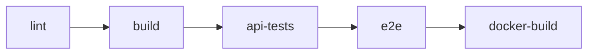

# Assignment 1 Report

## Project Information

- **Course Task:** Assignment 1
- **Deadline:** Week 2
- **Project Under Test:** Inkwell Platform
- **System Type:** Web Application

---

## 1. Introduction

This report presents the Assignment 1 QA deliverables for the **Inkwell Platform**, a full-stack blogging web application. The purpose of this assignment is to establish a structured quality assurance foundation before deeper automation and experimental testing are added in later coursework.

The report focuses on four required areas:

1. **Risk Assessment** of the chosen system.
2. **QA Test Strategy** based on risk.
3. **QA Environment Setup** including tools, repository structure, and CI/CD.
4. **Baseline Metrics and Evidence Placeholders** for future research analysis.

This document is intentionally written as an **academic project report**, not as product documentation or a deployment guide.

---

## 2. System Description

### 2.1 Overview of the chosen system

The selected system is the **Inkwell Platform**, a web application that supports publishing and managing blog content. The system contains both a frontend and backend and is complex enough to support meaningful risk-based prioritization while still being manageable within the assignment timeframe.

### 2.2 Main functional areas

The project includes the following major capabilities:

- user registration and login,
- session handling with authentication tokens,
- role-based access control,
- post creation and editing,
- comments, likes, and bookmarks,
- profile management and avatar upload,
- administrative moderation features,
- backend API documentation.

### 2.3 Why this system was selected

This system is suitable for the assignment because it contains several modules with different risk levels. Some failures would have a direct effect on security and access control, while others would mainly affect user experience or content visibility. This makes it a strong candidate for **risk-based QA planning**.

---

## 3. QA Context: QA vs QC in This Project

Quality Assurance and Quality Control play different roles in this assignment.

| Area | QA focus | QC focus |
| --- | --- | --- |
| Planning | Prevent defects through strategy, prioritization, and process setup | Detect defects through execution and inspection |
| Workflow | Define repeatable practices and CI/CD checks | Verify whether output meets expected behavior |
| Evidence | Create documented methodology and baseline measures | Produce pass/fail results, reports, and screenshots |

In this project:

- **QA** is represented by risk analysis, tool selection, planning, and CI/CD integration.
- **QC** is represented by running automated tests, reviewing outputs, and checking evidence artifacts.

This aligns with **Agile/DevOps** practice because testing is not treated as a final isolated phase. Instead, it is integrated into the development workflow through repeatable automation and documentation.

---

## 4. Risk Assessment Methodology

### 4.1 Method used

The project was analyzed using a **risk-based testing approach**. Each major module was evaluated according to:

- **Probability** of failure on a scale from `1` to `5`,
- **Impact** of failure on a scale from `1` to `5`.

The overall risk score was calculated using:

**Risk Score = Probability × Impact**

### 4.2 Priority levels

| Score Range | Priority | Interpretation |
| --- | --- | --- |
| `16-25` | `P1` | Critical risk; must be prioritized first |
| `9-15` | `P2` | High risk; should receive focused testing |
| `1-8` | `P3` | Moderate or lower risk; can be covered selectively |

### 4.3 Assumptions

The following assumptions were made during analysis:

- the repository in this workspace is the official system under test,
- the goal of Assignment 1 is planning and baselining rather than final certification,
- the most severe quality risks in this project are related to security, authorization, and data integrity,
- external payment or third-party financial transactions are not part of this system scope.

### 4.4 Reasoning behind the methodology

A risk-based approach is appropriate because not all modules have equal business or technical impact. For example:

- a failure in authentication can block access or expose accounts,
- a failure in authorization can allow unauthorized admin actions,
- a failure in content workflows can damage data correctness,
- a failure in public navigation is important, but usually less severe than a security breach.

Therefore, the testing effort must begin with the modules whose failure would have the highest combined impact and probability.

---

## 5. Risk Assessment Results

### 5.1 Prioritized components/modules

| Rank | Component ID | Module | Probability | Impact | Score | Priority | Justification |
| --- | --- | --- | ---: | ---: | ---: | --- | --- |
| 1 | `C1` | Authentication and session lifecycle | 4 | 5 | 20 | `P1` | Directly affects secure access, session validity, and account protection |
| 1 | `C2` | Authorization and admin moderation | 4 | 5 | 20 | `P1` | Incorrect authorization may expose high-privilege functionality |
| 2 | `C3` | Post, comment, and like integrity | 4 | 4 | 16 | `P1` | Core content workflows must preserve ownership and correctness |
| 2 | `C4` | Profile management and avatar uploads | 3 | 4 | 12 | `P2` | Affects user data quality and upload safety |
| 3 | `C5` | Public feed and navigation | 3 | 3 | 9 | `P2` | Important for usability, but lower impact than security-critical failures |

### 5.2 Probability vs impact matrix

| Impact \ Probability | 1 | 2 | 3 | 4 | 5 |
| --- | --- | --- | --- | --- | --- |
| 5 | - | - | - | `C1, C2` | - |
| 4 | - | - | `C4` | `C3` | - |
| 3 | - | - | `C5` | - | - |
| 2 | - | - | - | - | - |
| 1 | - | - | - | - | - |

### 5.3 High-risk summary

The three most important testing priorities are:

1. **Authentication and session security**,
2. **Authorization and moderation control**,
3. **Content integrity and ownership rules**.

These components are prioritized because failure in these areas could create the greatest negative effect on confidentiality, integrity, trust, and overall system behavior.

---

## 6. QA Test Strategy

### 6.1 Scope

The scope of this strategy includes:

- frontend behavior relevant to critical workflows,
- backend API behavior,
- role and permission enforcement,
- content management workflows,
- QA automation assets,
- CI/CD validation flow,
- baseline reporting artifacts.

### 6.2 Objectives

The strategy is designed to:

- test the highest-risk modules first,
- protect critical security and authorization paths,
- validate correctness of core content features,
- establish a repeatable QA process,
- create measurable baseline data for the final research paper.

### 6.3 Test approach by risk level

| Priority | Module | Main testing approach | Supporting approach |
| --- | --- | --- | --- |
| `P1` | Authentication/session | Automated API integration testing | UI smoke validation |
| `P1` | Authorization/admin moderation | Automated API integration testing | Targeted manual/admin checks |
| `P1` | Content integrity | Automated API integration testing | Editorial smoke checks |
| `P2` | Profile/avatar | Integration testing | Targeted manual verification |
| `P2` | Public feed/navigation | Browser smoke testing | Exploratory manual testing |

### 6.4 Manual vs automated approach

The project uses a **mixed strategy**:

#### Automated testing

Automated testing is prioritized for high-risk and repeatable behaviors because it provides consistency and supports CI/CD execution.

Main automated focus areas:

- authentication,
- authorization,
- administrative controls,
- content integrity,
- smoke validation of major user journeys.

#### Manual testing

Manual testing supports areas where visual review, exploratory checks, or evidence collection are valuable.

Manual focus areas:

- medium-risk usability checks,
- Swagger review of API behavior,
- Postman evidence capture,
- screenshot collection for research documentation.

### 6.5 Entry criteria

Testing activities are considered ready when:

- the system repository is available,
- test tools are configured,
- the database environment is accessible,
- the application test environment is operational.

### 6.6 Exit criteria

The Assignment 1 baseline is considered complete when:

- high-risk areas have been mapped to planned tests,
- the QA environment is documented,
- CI/CD structure is documented,
- initial metrics are recorded,
- screenshot placeholders are prepared for later evidence insertion.

---

## 7. QA Environment Setup Report

### 7.1 Repository structure

The QA-relevant structure of the repository is summarized below.

```text
.
├── client/                  # Frontend application
├── server/                  # Backend application and integration tests
├── tests/e2e/               # Browser smoke tests
├── docs/qa/                 # QA support documents and artifacts
├── playwright.config.ts     # E2E configuration
├── package.json             # Workspace scripts
└── .github/workflows/qa.yml # CI/CD pipeline
```

### 7.2 Installed tools and purpose

| Tool / Framework | Purpose in the QA environment |
| --- | --- |
| `Vitest` | Backend automated test execution |
| `Supertest` | API integration request/response validation |
| `@vitest/coverage-v8` | Backend coverage reporting |
| `Playwright` | Browser-based smoke testing |
| `Swagger UI` | Manual API inspection and contract visibility |
| `Postman` | Reproducible API request evidence |
| `Docker` | Environment consistency and build verification |
| `GitHub Actions` | CI/CD quality gate automation |

### 7.3 CI/CD pipeline configuration

The QA pipeline is structured as a sequence of quality gates.



### 7.4 Role of the QA environment in the project

This environment supports the assignment by providing:

- repeatable automated checking,
- structured test organization,
- evidence-producing reports,
- CI/CD integration suitable for later research comparison.

### 7.5 Repository evidence relevant to the report

The project already contains repository elements that support Assignment 1 reporting:

- integration test suites,
- end-to-end smoke tests,
- a Postman collection,
- QA documentation files,
- a CI workflow definition.

These elements demonstrate that the environment is not theoretical; it is already aligned with practical QA activity.

---

## 8. Baseline Metrics

### 8.1 Recorded baseline metrics

| Metric | Baseline |
| --- | --- |
| High-risk modules count | `5` |
| API automated scenarios | `27` |
| UI smoke scenarios | `4` |
| Observed API result | `27/27` passed |
| Observed UI smoke result | `4/4` passed |
| Backend statement coverage | `75.87%` |
| Backend line coverage | `75.35%` |
| Pipeline stages | `5` |

### 8.2 Coverage planning baseline

| Priority | Module | Planned coverage direction |
| --- | --- | --- |
| `P1` | `C1` Authentication/session | Strong automated coverage |
| `P1` | `C2` Authorization/admin moderation | Strong automated coverage |
| `P1` | `C3` Content integrity | Strong automated coverage |
| `P2` | `C4` Profile/avatar | Mixed automated and manual coverage |
| `P2` | `C5` Public browsing/navigation | Smoke and exploratory coverage |

### 8.3 Estimated testing effort

| Work Item | Estimated Effort |
| --- | --- |
| Risk analysis and documentation alignment | `1.5 days` |
| API testing baseline maintenance | `2-3 days` |
| Smoke testing maintenance | `1 day` |
| CI/CD validation and artifact review | `0.5 day` |
| Final report and evidence packaging | `0.5 day` |

### 8.4 Interpretation of the baseline

The recorded baseline shows that the project already has measurable QA assets and clear testing priorities. At the same time, the current coverage percentage indicates room for future improvement, which is useful for later comparison in the final research paper.

---

## 9. Deliverables Checklist

The assignment requires four main deliverables. The table below shows where each one is represented in this report.

| Required Deliverable | Covered In |
| --- | --- |
| 1. Risk Assessment Document | Section 5 |
| 2. QA Test Strategy Document | Section 6 |
| 3. QA Environment Setup Report | Section 7 |
| 4. Baseline Metrics and Screenshots | Sections 8 and 10 |

---

## 10. Screenshot and Evidence Placeholders

> The following placeholders are intentionally left for final submission evidence. Replace them with actual screenshots before converting the report to PDF.

### 10.1 Required screenshot placeholders

| Evidence Type | Placeholder | What should be included |
| --- | --- | --- |
| CI/CD pipeline result | `[Insert Screenshot: CI Pipeline Pass]` | A successful pipeline run showing all QA stages |
| Coverage summary | `[Insert Screenshot: Coverage Summary]` | Coverage report with statement and line percentages |
| Playwright report | `[Insert Screenshot: Playwright Report]` | Smoke test execution summary or HTML report |
| Swagger UI | `[Insert Screenshot: Swagger UI]` | API documentation page for reproducibility evidence |
| Repository QA structure | `[Insert Screenshot: QA Folder Structure]` | Files and folders related to QA assets |
| Postman collection evidence | `[Insert Screenshot: Postman Collection]` | Request collection relevant to Assignment 1 |

### 10.2 Placeholder insertion template

#### CI/CD Pipeline Pass

`[Insert Screenshot: CI Pipeline Pass]`

#### Coverage Summary

`[Insert Screenshot: Coverage Summary]`

#### Playwright Report

`[Insert Screenshot: Playwright Report]`

#### Swagger UI

`[Insert Screenshot: Swagger UI]`

#### QA Folder Structure

`[Insert Screenshot: QA Folder Structure]`

#### Postman Collection Evidence

`[Insert Screenshot: Postman Collection]`

---

## 11. Contribution to the Final Research Paper

This Assignment 1 report directly supports the final project in the following ways.

### 11.1 Introduction chapter support

It provides:

- the selected system overview,
- the reason for choosing the system,
- the QA context for the study.

### 11.2 Methodology chapter support

It documents:

- the risk assessment method,
- assumptions and prioritization logic,
- test strategy decisions,
- tool and environment selection,
- baseline measures.

### 11.3 Foundation for later assignments

Later coursework can extend this baseline through:

- deeper automation,
- additional experiments,
- defect trend comparison,
- improved coverage,
- stronger evidence collection.

Screenshots, configuration references, and initial QA assets also provide reproducibility evidence for the final paper.

---

## 12. Conclusion

The Inkwell Platform is an appropriate system for Assignment 1 because it includes multiple high-impact modules that can be prioritized through risk-based testing. The analysis identified five major QA modules, with authentication, authorization, and content integrity receiving the highest priority.

The project already includes a meaningful QA environment with testing tools, repository organization, and CI/CD support. This makes it possible to record credible baseline metrics and prepare a structured foundation for later assignments and the final research paper.

Overall, this report satisfies the assignment requirements by presenting the risk assessment, strategy, environment setup, and baseline metrics in a single academic-style document, while also reserving placeholders for screenshots and reproducibility evidence.
