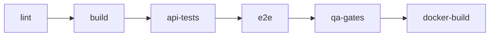

# Assignment 2 Report

## Project Information

**Course Task:** Assignment 2
**Project Under Test:** Inkwell Platform
**System Type:** Web Application
**Team Members:** Asqar Nurym, Aibyn Talgatov, Kuanshpek Zhansaya
**Group:** CSE-2505M

## 1. Introduction

This report presents the Assignment 2 QA deliverables for the **Inkwell Platform**, a full-stack blogging web application. The work in this assignment builds directly on the risk assessment, QA strategy, environment setup, and baseline metrics established in Assignment 1.

The purpose of Assignment 2 is to move from planning into controlled implementation. The report therefore focuses on applying automation to the highest-risk parts of the system, defining enforceable quality gates, collecting measurable execution results, and preparing evidence that can be reused in the later research paper sections.

The report is structured according to the required Assignment 2 components:

1. **Automated Test Implementation**
2. **Quality Gate Definition and Integration**
3. **Metrics Collection**
4. **Documentation and Reproducibility Evidence**
5. **Deliverables Checklist**

The document is written as an **academic QA report**. Its purpose is to show (1)what was automated, (2)why those areas were selected, (3)how the automated checks were integrated into CI/CD, and (4)what measurable results were obtained from the current implementation.

## 2. Automated Test Implementation

The automated implementation followed the risk model defined in Assignment 1. Work began with all **`P1`** modules because those components carry the highest combined probability and impact of failure. After those flows were covered, the automation scope was extended with targeted checks for **`P2`** modules to improve overall confidence and evidence quality.

At the current stage, the repository contains:

- **`38`** automated API scenarios executed through **`Vitest + Supertest`**
- **`4`** browser smoke scenarios executed through **`Playwright`**
- reusable helpers for authentication, seeded test data, and repeatable environment reset

### 2.1 Identify Test Scope

| Module / Feature                                 | High-Risk Function                                                                     | Test Priority | Notes / Expected Outcome                                                                                    |
| ------------------------------------------------ | -------------------------------------------------------------------------------------- | ------------- | ----------------------------------------------------------------------------------------------------------- |
| `C1` Authentication and session lifecycle      | registration, login, refresh rotation, logout, authenticated session lookup            | `High`      | Invalid credentials must fail, refresh tokens must rotate, revoked sessions must not be reusable            |
| `C2` Authorization and admin moderation        | admin-only access to users, roles, reports, categories, and tags                       | `High`      | Non-admin users must be blocked; admins must be able to inspect and moderate controlled resources           |
| `C3` Content integrity and moderation workflow | post ownership, publish/archive/restore lifecycle, comments, likes, bookmarks, reports | `High`      | Ownership and lifecycle rules must remain consistent across create, update, moderation, and reporting flows |
| `C4` Profile management and avatar uploads     | profile updates, duplicate email validation, avatar MIME and size validation           | `Medium`    | Account data must remain unique and uploads must be accepted only for valid image files within size limits  |
| `C5` Public browsing and discovery flows       | published feed visibility, filters, bookmark/report UI journeys                        | `Medium`    | Only published content should appear publicly; integrated reader workflows must remain functional           |

### 2.2 Define Test Cases

The full implementation contains more scenarios than can be listed compactly in the report, so the table below records representative test cases that cover the critical behaviors required by the assignment.

| Test Case ID | Module / Feature      | Description                                          | Input Data                                                   | Expected Result                                                             | Scenario Type | Notes                                             |
| ------------ | --------------------- | ---------------------------------------------------- | ------------------------------------------------------------ | --------------------------------------------------------------------------- | ------------- | ------------------------------------------------- |
| `TC01`     | Authentication        | Register first platform user                         | valid name, email, password                                  | user is created as admin and `/api/auth/me` returns authenticated profile | `Positive`  | verifies bootstrap admin path                     |
| `TC02`     | Authentication        | Reject invalid login                                 | valid email with wrong password                              | login returns `401` with `Invalid credentials.`                         | `Negative`  | validates secure failure behavior                 |
| `TC03`     | Session lifecycle     | Rotate refresh token and reject reuse                | valid refresh cookie, then repeated use of old cookie        | first refresh succeeds, reused token returns `401`                        | `Negative`  | protects against session replay                   |
| `TC04`     | Authorization         | Block non-admin user from admin routes               | authenticated regular user requests `/api/admin/users`     | response returns `403` with admin access error                            | `Negative`  | proves role enforcement                           |
| `TC05`     | Content integrity     | Allow author to manage own post                      | authenticated author creates, updates, deletes post          | all operations succeed and deleted post returns `404` afterward           | `Positive`  | validates ownership flow                          |
| `TC06`     | Content integrity     | Prevent outsider from managing another author's post | author, outsider, and admin accounts                         | outsider receives `403`, admin moderation action succeeds                 | `Negative`  | covers ownership + moderation boundary            |
| `TC07`     | Editorial workflow    | Draft to publish to archive to restore               | authenticated author and draft post                          | status transitions follow `draft -> published -> archived -> draft`       | `Positive`  | validates core lifecycle logic                    |
| `TC08`     | Profile / avatar      | Reject unsupported avatar upload                     | authenticated user uploads `text/plain` file               | upload returns `415` with MIME validation message                         | `Negative`  | protects upload surface                           |
| `TC09`     | Security hardening    | Throttle repeated auth attempts                      | repeated invalid login from same forwarded client IP         | first five attempts return `401`, next attempt returns `429`            | `Negative`  | validates basic brute-force protection            |
| `TC10`     | Taxonomy / moderation | Reject duplicate category or tag creation            | authenticated admin sends existing category/tag name         | API returns `409` conflict                                                | `Negative`  | protects admin data integrity                     |
| `TC11`     | Reader workflow       | Bookmark and report published content                | authenticated reader bookmarks post and reports post/comment | bookmark is stored and both reports are created                             | `Positive`  | validates integrated user-facing moderation entry |
| `TC12`     | Browser smoke         | Review reports queue in UI                           | admin logs in and opens reports page                         | open reports are visible and resolvable through UI                          | `Positive`  | confirms end-to-end moderation path               |

### 2.3 Track Script Implementation

| Script ID | Module / Feature                      | Automation Framework   | Script Name / Location                                | Status       | Comments                                                                                                              |
| --------- | ------------------------------------- | ---------------------- | ----------------------------------------------------- | ------------ | --------------------------------------------------------------------------------------------------------------------- |
| `S01`   | Authentication and session lifecycle  | `Vitest + Supertest` | `server/src/test/auth.integration.test.ts`          | `Complete` | covers registration, duplicate registration, invalid login, refresh rotation,`/auth/me`, and logout                 |
| `S02`   | Post, comment, and like integrity     | `Vitest + Supertest` | `server/src/test/blog.integration.test.ts`          | `Complete` | focuses on ownership rules, unauthorized mutation blocking, comment validation, and duplicate-like prevention         |
| `S03`   | Editorial workflow and moderation     | `Vitest + Supertest` | `server/src/test/editorial.integration.test.ts`     | `Complete` | covers publish/archive/restore lifecycle, public feed filtering, bookmarks, reports, and admin moderation             |
| `S04`   | Profile management and admin controls | `Vitest + Supertest` | `server/src/test/profile-admin.integration.test.ts` | `Complete` | validates profile updates, avatar upload rules, admin dashboards, role changes, and last-admin protection             |
| `S05`   | Taxonomy administration               | `Vitest + Supertest` | `server/src/test/taxonomy.integration.test.ts`      | `Complete` | covers create, update, delete, duplicate handling, and missing-record paths for categories and tags                   |
| `S06`   | Security hardening checks             | `Vitest + Supertest` | `server/src/test/security.integration.test.ts`      | `Complete` | verifies response headers, no-store auth responses, and auth rate limiting                                            |
| `S07`   | Cross-layer smoke validation          | `Playwright`         | `tests/e2e/smoke.spec.ts`                           | `Complete` | validates taxonomy setup, editorial publish flow, bookmark/report path, and report-queue handling through the browser |

The implementation was kept maintainable by centralizing common API setup in test helpers, resetting the test database between runs, and keeping the browser suite focused on a small set of high-value integrated workflows instead of broad but fragile UI coverage.

### 2.4 Version Control Tracking

The table below lists representative repository milestones that show the implementation history of the automation layer and supporting application changes.

| Commit ID / Hash | Date           | Module / Feature                           | Description of Changes                                                                                                          | Author          |
| ---------------- | -------------- | ------------------------------------------ | ------------------------------------------------------------------------------------------------------------------------------- | --------------- |
| `1b2fd21`      | `2026-03-15` | QA automation baseline                     | Added initial QA workflow, backend integration suites, Playwright smoke setup, Docker support, and QA documentation scaffolding | `Aibyn`       |
| `a90514f`      | `2026-03-18` | Editorial API and moderation scope         | Expanded backend API with taxonomy, bookmarks, reports, and editorial workflow capabilities needed for higher-risk automation   | `Asqar Nyrym` |
| `d14be45`      | `2026-03-18` | Browser-testable admin and workspace flows | Added focused frontend admin/workspace pages and routes required for reliable smoke automation                                  | `Asqar Nyrym` |
| `6bd6860`      | `2026-03-18` | Editorial API and e2e smoke coverage       | Added editorial integration tests and extended Playwright smoke coverage for publish, moderation, and taxonomy flows            | `Asqar Nyrym` |
| `0c17414`      | `2026-03-19` | QA execution normalization                 | Refined local QA execution flow and aligned supporting documentation with repeatable automated runs                             | `Asqar Nyrym` |

### 2.5 Evidence for Research Paper

The automation outputs already generate reproducible evidence artifacts. These files serve as direct input for later reporting, metrics analysis, and screenshot capture during final packaging.

| Evidence ID | Module / Feature                            | Type            | Description                                                                                    | File Location / Link                                  |
| ----------- | ------------------------------------------- | --------------- | ---------------------------------------------------------------------------------------------- | ----------------------------------------------------- |
| `E01`     | Authentication and session lifecycle        | `Log`         | machine-readable API execution output including auth, refresh, and logout scenarios            | `.tmp/qa/vitest-report.json`                        |
| `E02`     | Content integrity and moderation workflow   | `Code`        | source of editorial workflow, bookmark, report, and moderation API checks                      | `server/src/test/editorial.integration.test.ts`     |
| `E03`     | Authorization and admin moderation          | `Code`        | source of admin user, role, report, and moderation checks                                      | `server/src/test/profile-admin.integration.test.ts` |
| `E04`     | Cross-layer smoke validation                | `HTML Report` | browser execution report for taxonomy, publishing, bookmark/report, and report-queue scenarios | `playwright-report/`                                |
| `E05`     | Automation coverage and quality-gate status | `Log`         | unified QA summary combining API results, e2e results, coverage, and gate outcomes             | `.tmp/qa/qa-summary.json`                           |
| `E06`     | Coverage measurement                        | `Report`      | backend coverage summary used later in quality-gate evaluation                                 | `server/coverage/coverage-summary.json`             |

This section demonstrates that the automation work is not only implemented but also traceable through executable scripts, repository history, and reproducible evidence files.

## 3. Quality Gate Definition and Integration

Assignment 2 requires the automation layer to be more than a collection of runnable tests. It must also define explicit pass/fail criteria and enforce them through a repeatable CI/CD flow. In the current implementation, this requirement is satisfied through a combination of:

- repository-level workflow checks in GitHub Actions
- machine-readable QA artifacts generated by test execution
- a dedicated quality-gate evaluation step that reads those artifacts and fails the pipeline when thresholds are not met

The resulting model keeps release decisions based on measurable results rather than on manual interpretation alone. Compared with Assignment 1, the main improvement in this section is that the pipeline no longer stops at test execution only. It now includes a dedicated quality-gate evaluation stage that checks whether the measured results satisfy the agreed thresholds.

### 3.1 Define Pass / Fail Criteria

The formal QA gates are evaluated from a unified QA summary generated after the automated runs. That summary combines API results, browser results, high-risk module coverage, and backend coverage into one decision layer. For the report, the important point is not the internal file location, but the measured values shown below.

| Quality Gate ID | Metric / Criterion         | Threshold / Requirement                    | Importance | Observed Result (`2026-04-03`) | Notes                                                                  |
| --------------- | -------------------------- | ------------------------------------------ | ---------- | -------------------------------- | ---------------------------------------------------------------------- |
| `QG01`        | Backend statement coverage | `>= 80%`                                 | `High`   | `83.73%`                       | protects execution breadth across backend logic                        |
| `QG02`        | Backend line coverage      | `>= 80%`                                 | `High`   | `83.33%`                       | confirms useful execution depth, not only superficial route access     |
| `QG03`        | API failed tests           | `0` allowed                              | `High`   | `0`                            | any failed API integration scenario blocks the gate                    |
| `QG04`        | E2E failed or flaky tests  | `0` allowed                              | `High`   | `0`                            | flaky browser execution is treated as unacceptable for the smoke layer |
| `QG05`        | `P1` automation coverage | `100%` of `P1` modules must be covered | `High`   | `100%`                         | proves the risk-based strategy is actually enforced                    |

These gates were selected because they correspond directly to the Assignment 2 goals:

- coverage gates measure whether automation reaches enough of the critical backend surface
- execution gates measure reliability of API and browser automation
- risk-coverage gate measures whether the most important modules from Assignment 1 were actually automated

In addition to the formal QA gates, the CI pipeline also enforces supporting delivery checks:

- format check
- linting
- build verification
- Docker image build verification

These supporting checks are separate from `QG01-QG05`, but they still act as practical release gates in the workflow.

### 3.2 Integrate Tests into CI/CD Pipeline

The CI/CD implementation uses a GitHub Actions workflow triggered on both `push` and `pull_request`. The pipeline is ordered so that low-cost checks fail early, while heavier automated validation runs only after the repository has passed the earlier gates.

| Pipeline Step       | Description                                                             | Tool / Framework                                              | Trigger                    | Notes                                                                       |
| ------------------- | ----------------------------------------------------------------------- | ------------------------------------------------------------- | -------------------------- | --------------------------------------------------------------------------- |
| `1. lint`         | checks formatting and source lint rules                                 | `Prettier`, `ESLint`, `GitHub Actions`                  | `push`, `pull_request` | workflow also verifies that lint autofix does not leave uncommitted changes |
| `2. build`        | compiles frontend and backend workspaces                                | `TypeScript`, workspace build scripts                       | `push`, `pull_request` | ensures test execution uses buildable code only                             |
| `3. api-tests`    | runs backend integration suite with coverage against PostgreSQL service | `Vitest`, `Supertest`, `PostgreSQL`, `GitHub Actions` | `push`, `pull_request` | uploads `vitest-report.json` and backend coverage artifacts               |
| `4. e2e`          | runs browser smoke suite after API validation passes                    | `Playwright`                                                | `push`, `pull_request` | uploads HTML report, failure output, and `playwright-report.json`         |
| `5. qa-gates`     | restores artifacts and evaluates formal QA thresholds                   | custom `qa:summary` and `qa:gates` scripts                | `push`, `pull_request` | converts raw test results into explicit pass/fail gate decisions            |
| `6. docker-build` | verifies backend image can still be packaged successfully               | `Docker`                                                    | `push`, `pull_request` | protects deployment readiness after the QA gates pass                       |

The logical flow of the pipeline is shown below:

The artifact flow is also important. The pipeline does not evaluate quality gates directly inside the API or browser jobs. Instead, it first collects the generated reports from those stages and then evaluates them centrally in the dedicated `qa-gates` stage. This design improves traceability because the same execution evidence can be:

- used for automated gate decisions
- uploaded for reviewer inspection
- reused later as evidence in the report

### 3.3 Alerting and Failure Handling Procedures

The current repository does not include external Slack or email alerting. The effective alerting channel is the GitHub Actions workflow status itself, together with job logs and uploaded artifacts. This is sufficient for the assignment because failures are visible on `push` and `pull_request`, and each failed stage exposes the specific logs required for investigation.

| Scenario / Event               | Alert Type                               | Recipient / Channel                                                     | Action Required                                                               | Notes                                                            |
| ------------------------------ | ---------------------------------------- | ----------------------------------------------------------------------- | ----------------------------------------------------------------------------- | ---------------------------------------------------------------- |
| Format or lint failure         | failed GitHub Actions job                | repository contributors and reviewers through workflow/PR status        | correct formatting or lint violations, rerun pipeline                         | early failure prevents wasting CI time on heavier jobs           |
| Build failure                  | failed GitHub Actions job                | repository contributors and reviewers through workflow/PR status        | fix compilation issue before test stages continue                             | protects against invalid test interpretation on unbuildable code |
| API integration failure        | failed `api-tests` job + machine-readable test artifact | repository contributors via Actions logs and artifacts                  | inspect failing API scenario, fix service or test issue, rerun                | API execution output preserves reproducible evidence            |
| Browser smoke failure or flake | failed `e2e` or `qa-gates` status    | repository contributors via Actions logs, HTML report, and test results | inspect Playwright report, screenshots, and traces; stabilize or fix workflow | flakes are treated as failures in the formal QA gate             |
| Coverage below threshold       | failed `qa-gates` job                  | repository contributors via explicit gate output in workflow logs       | expand or improve tests, then rerun                                           | gate output prints actual value and threshold                    |
| `P1` coverage below target   | failed `qa-gates` job                  | repository contributors via explicit gate output in workflow logs       | add automation for uncovered high-risk module(s) before accepting build       | directly tied to Assignment 1 risk model                         |
| Docker build failure           | failed `docker-build` job              | repository contributors via workflow status and logs                    | inspect packaging/build changes and repair image build path                   | acts as final deployment-oriented verification                   |

This failure-handling model is intentionally simple and evidence-driven. Each failure produces a visible status, a reproducible log, and in several cases an uploaded artifact that can be reviewed after the run has completed.

### 3.4 Current Quality-Gate Results

The most recent local gate evaluation executed on `2026-04-03` produced the following results:

| Quality Gate ID | Metric                     |    Actual | Threshold | Status   |
| --------------- | -------------------------- | --------: | --------: | -------- |
| `QG01`        | backend statement coverage | `83.73` |    `80` | `Pass` |
| `QG02`        | backend line coverage      | `83.33` |    `80` | `Pass` |
| `QG03`        | api failed tests           |     `0` |     `0` | `Pass` |
| `QG04`        | e2e failed or flaky tests  |     `0` |     `0` | `Pass` |
| `QG05`        | `P1` automation coverage |   `100` |   `100` | `Pass` |

As a result, the gate evaluation completed successfully and all quality gates passed. This confirms that the current automation layer satisfies the enforced Assignment 2 thresholds in its present state.
