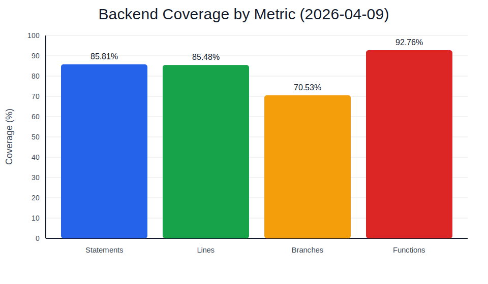
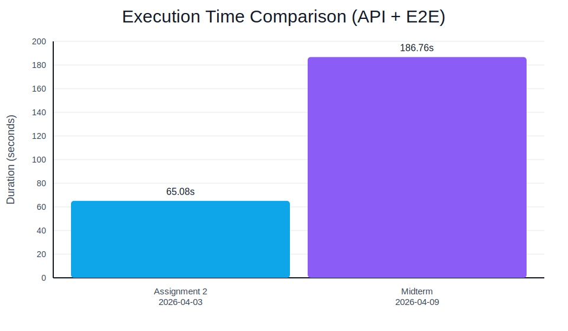
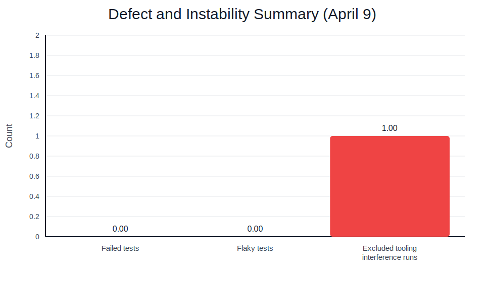

# Midterm Project Report: QA Implementation and Analysis

## Project Information

**Course Task:** Midterm Project  
**Project Under Test:** Inkwell Platform  
**System Type:** Web Application  
**Team Members:** Asqar Nurym, Aibyn Talgatov, Kuanshpek Zhansaya  
**Group:** CSE-2505M  
**Primary Evidence Date:** `2026-04-09`

This report documents the midterm QA implementation state of the Inkwell Platform using fresh local evidence collected on `2026-04-09`. Assignment 1 and Assignment 2 artifacts are used only as historical comparison points. All current conclusions are based on the latest local runs, generated artifacts, and repository code.

## 1. System Description

Inkwell Platform is a full-stack blogging and moderation system. The application supports user registration and login, role-based authorization, post creation and lifecycle management, comments, likes, bookmarks, reports, profile editing, avatar uploads, taxonomy management, and an admin moderation workspace. From a QA perspective, the most important properties are access control, session correctness, content integrity, and reliable handling of public versus restricted content.

### 1.1 Architecture and Stack

| Layer | Implementation | QA Relevance |
| ----- | -------------- | ------------ |
| Frontend | React + TypeScript + Vite (`client/`) | provides browser workflows for smoke coverage and public/admin route validation |
| Backend API | Express + TypeScript (`server/`) | contains most business logic, authorization rules, and validation paths |
| Persistence | PostgreSQL via TypeORM | stores users, tokens, posts, comments, likes, bookmarks, reports, tags, and categories |
| CI/CD | GitHub Actions (`.github/workflows/qa.yml`) | enforces lint, build, API tests, E2E tests, quality gates, and Docker build verification |
| QA Evidence Layer | custom summary and gate scripts in `server/src/qa/` | aggregates coverage, execution outcomes, risk-module status, and gate results |

### 1.2 Key Functional Areas

| ID | Functional Area | QA Importance |
| -- | --------------- | ------------- |
| `C1` | Authentication and session lifecycle | protects account access, token rotation, and authenticated session integrity |
| `C2` | Authorization and admin moderation | protects admin-only actions such as role updates, taxonomy management, and report handling |
| `C3` | Content integrity and moderation workflow | protects author ownership, draft/publish/archive flow, comments, likes, bookmarks, and reports |
| `C4` | Profile management and avatar uploads | protects user data quality, duplicate-email handling, and upload validation |
| `C5` | Public browsing and discovery flows | protects public feed visibility, filters, and reader-facing content access |

## 2. Methodology

The QA methodology remained risk-based. Assignment 1 identified the critical components and their probability/impact scores. Assignment 2 established the automation baseline, CI/CD workflow, and quality gates. The midterm implementation extends that baseline by deepening automated checks, producing module-level coverage evidence, and re-evaluating residual risk using current April 9 results.

### 2.1 Risk-Based Prioritization Baseline

| ID | Component | Original Score | Priority |
| -- | --------- | -------------- | -------- |
| `C1` | Authentication and session lifecycle | `20` | `P1` |
| `C2` | Authorization and admin moderation | `20` | `P1` |
| `C3` | Content integrity and moderation workflow | `16` | `P1` |
| `C4` | Profile management and avatar uploads | `12` | `P2` |
| `C5` | Public browsing and discovery flows | `9` | `P2` |

The implementation target remained unchanged:

- all `P1` modules must remain automated
- line coverage is the primary coverage metric for module-level adequacy
- branch coverage is reported separately as a detectability signal
- release decisions continue to use the existing `QG01-QG05` gate set

### 2.2 Test Design Strategy

| Test Layer | Primary Purpose | Midterm Use |
| ---------- | --------------- | ----------- |
| Unit | isolate branch-heavy business rules cheaply | used for post-visibility resolution and report-target validation |
| Integration | validate API behavior, persistence, authorization, and data integrity | remains the main confidence layer for auth, moderation, content, uploads, and taxonomy |
| E2E | validate critical user-facing paths across frontend, backend, and DB | used for admin workflow, publishing flow, reader actions, invalid login UX, and admin-route blocking |
| Manual support | inspect contracts and visual evidence | supported by Swagger UI, Postman collection, and stored screenshots |

### 2.3 Toolchain

| Tool | Purpose | Reason for Use |
| ---- | ------- | -------------- |
| `Vitest` | backend unit and integration execution | fast TypeScript-native runner already aligned with the backend workspace |
| `Supertest` | API request/response validation | exercises Express behavior without browser noise |
| `Playwright` | browser smoke coverage | validates integrated user flows and produces replayable evidence |
| `TypeORM + PostgreSQL` | realistic persistence behavior | required to validate session rotation, uniqueness constraints, moderation, and concurrent mutations |
| custom QA scripts | artifact summarization and quality gates | converts raw execution outputs into measurable QA decisions |
| `GitHub Actions` | CI/CD enforcement | keeps release checks version-controlled and repeatable |

### 2.4 Comparative Tool and Technology Analysis

The selected QA stack was chosen not only because the tools are popular, but because they fit the repository structure, the current CI/CD workflow, and the evidence requirements of the midterm. The most relevant alternatives are compared below at the API, browser, and delivery layers.

#### 2.4.1 API Automation Tools

| Comparison Dimension | Selected Tool | Alternative Tool | Relevance to Inkwell |
| -------------------- | ------------- | ---------------- | -------------------- |
| integration with current stack | `Vitest + Supertest` fits the TypeScript backend directly and already drives the current `server/package.json` scripts | `Jest + Supertest` would be viable, but would add migration and maintenance overhead without solving a current gap | the repo already runs backend tests through `vitest` and exports QA artifacts from that path |
| execution speed / efficiency | lightweight and fast for integration-heavy backend validation | mature, but typically heavier for the same workflow in this repo | the April 9 run produced `46/46` passing API scenarios with coverage export in one flow |
| maintainability | low-friction because it matches the current backend workspace and existing tests | would require replacing or dual-maintaining the test runner layer | the current suite is already stable and readable with the existing stack |
| CI/CD suitability | works directly with `npm run test:coverage` and JSON artifact export | workable, but would require equivalent reporter and artifact reconfiguration | the QA pipeline already depends on the current `vitest-report.json` generation path |
| evidence/reporting quality | currently produces coverage and machine-readable API results used by the report | could produce similar output, but that value is not unique enough to justify migration | the report already cites `.tmp/qa/vitest-report.json` and `server/coverage/coverage-summary.json` |
| limitations | less widely standardized in legacy enterprise teams than Jest | more familiar in some teams, but not a better fit for this repo's actual setup | tool familiarity alone would not improve coverage depth or evidence quality here |
| fit for current midterm scope | best fit because it preserves the working backend automation path with minimal friction | acceptable alternative, but unnecessary for the current scope | the midterm goal was stronger evidence, not runner replacement |

`Vitest + Supertest` was the better fit because it is TypeScript-native, already aligned with the backend workspace scripts, introduces almost no migration friction, and supports direct API validation without browser noise. That choice is supported by the current repo evidence: `server/package.json` runs the backend suite through `vitest`, the April 9 baseline shows `46/46` passing API scenarios, and coverage artifacts are already generated in the format used by the QA report.

#### 2.4.2 Browser Automation Tools

| Comparison Dimension | Selected Tool | Alternative Tool | Relevance to Inkwell |
| -------------------- | ------------- | ---------------- | -------------------- |
| integration with current stack | `Playwright` already drives the root `test:e2e` workflow and artifact generation | `Cypress` could cover browser flows, but is not part of the current repo execution model | the current E2E evidence and screenshots already depend on Playwright outputs |
| execution speed / efficiency | efficient for a small smoke suite and controlled browser orchestration | competitive for many UI workflows, but not clearly better for this repo's smoke-style suite | the project uses a focused `6/6` smoke baseline rather than broad UI regression coverage |
| maintainability | strong fit for multi-step cross-layer smoke tests with minimal special casing | solid for interactive debugging, but not a better match for the current pipeline | the present browser suite is small, stable, and tied to artifact export rather than heavy UI authoring ergonomics |
| CI/CD suitability | integrates cleanly with headless CI runs and report uploads | also CI-capable, but would require new workflow and artifact conventions | the current GitHub Actions job already uploads Playwright reports and failure output |
| evidence/reporting quality | strong HTML reports, screenshot support, and structured outputs | capable, but the repo already has Playwright report evidence in use | the report cites `.tmp/qa/playwright-report.json`, `playwright-report/`, and screenshot assets |
| limitations | frontend build warnings still surface during E2E setup, and browser tests are slower than API tests | alternative tooling would not remove the underlying app/runtime issues automatically | the main limitation is application/runtime cost, not the browser tool choice itself |
| fit for current midterm scope | best fit for deterministic integrated smoke coverage with reusable evidence | viable, but unnecessary for the current project scale and report goals | the midterm required visible browser evidence more than a change in test authoring model |

`Playwright` was the better fit because it provides stronger artifact output, deterministic browser orchestration, and a cleaner match for smoke-style integrated user flows. That choice is supported by the repo itself: the root `package.json` runs `playwright test`, the April 9 baseline shows `6/6` passing E2E scenarios, and the report already depends on existing Playwright report and screenshot evidence.

#### 2.4.3 CI/CD Platform Choice

| Comparison Dimension | Selected Tool | Alternative Tool | Relevance to Inkwell |
| -------------------- | ------------- | ---------------- | -------------------- |
| integration with current stack | `GitHub Actions` is already the repo's delivery platform and matches the hosted workflow model | `Jenkins` could run the same steps, but would add separate operational and maintenance overhead | the repository already stores the full QA pipeline as `.github/workflows/qa.yml` |
| execution speed / efficiency | sufficient for the project size and simple staged pipeline | powerful, but heavier to operate for a small academic repo | the current job chain already supports lint, build, API, E2E, gates, and Docker verification |
| maintainability | version-controlled YAML workflow with minimal infrastructure burden | would require separate server management, plugin maintenance, and job administration | project scale does not justify Jenkins operational complexity |
| CI/CD suitability | native fit for PR/push validation and artifact passing between jobs | technically capable, but not a simpler option for this repository | the QA workflow already restores artifacts and evaluates gates in a dedicated job |
| evidence/reporting quality | built-in artifact upload/restore flow supports reproducible QA evidence | could replicate the same flow, but not with less effort in this environment | the report already cites successful workflow evidence and uploaded artifact locations |
| limitations | less customizable than a fully self-managed CI platform in some advanced scenarios | more flexible at enterprise scale, but with higher upkeep cost | the project does not require enterprise-grade CI customization |
| fit for current midterm scope | best fit because it is already in place and produces the report's evidence chain | overpowered for the current scope and team size | the midterm benefits more from reproducibility than from CI platform breadth |

`GitHub Actions` was the better fit because it is native to the repository, supports a simple artifact upload and restore flow, and is sufficient for this project's scale without Jenkins operational overhead. The current evidence chain depends on that choice: `.github/workflows/qa.yml` defines the staged QA flow, the `qa-gates` job restores artifacts before evaluating thresholds, and the report already references successful workflow execution and stored QA artifacts.

### 2.5 Literature Review Context

The implemented QA approach also aligns with several established ideas in software testing literature and practice. First, `risk-based testing` argues that test effort should be concentrated where failure probability and failure impact intersect most strongly. That principle directly matches the Inkwell prioritization model, where `C1-C3` were treated as the most important modules because authentication, authorization, and content integrity failures would be more damaging than lower-risk regressions.

Second, `layered automation` models such as the test pyramid recommend concentrating most automated checks below the UI layer because lower-level tests are cheaper, faster, and easier to stabilize. The current implementation reflects that guidance: the API and unit layers provide most of the coverage and branch-depth evidence, while the browser layer remains intentionally small and focused on high-value smoke flows rather than broad but fragile UI automation.

Third, `shift-left` and `CI-oriented` quality practices emphasize early, repeatable validation instead of relying on late manual inspection. That idea is reflected in the repository workflow, where linting, build verification, API execution, E2E execution, and quality-gate evaluation are all part of the same automated delivery chain. Finally, `secure-by-default` guidance remains relevant because the system under test includes account access, role-based moderation, and token lifecycle management. As a result, the QA strategy does not evaluate only functional correctness, but also validation around session handling, protected routes, and misuse scenarios.

These literature-based ideas are complementary rather than competing. Risk analysis determines what should be automated first, layered automation determines where that automation should live, CI/CD determines when results become enforceable release evidence, and secure-by-default thinking ensures that the validated baseline is not only functional but also defensible from a quality and security perspective.

## 3. Automation Implementation

### 3.1 QA Evidence Layer Upgrade

The midterm implementation extended the internal QA evidence layer rather than changing external product behavior.

- `server/src/qa/reporting.ts` now maps risk modules `C1-C5` to concrete backend source files.
- The generated QA summary now includes per-module statement, line, function, and branch coverage.
- Line coverage is treated as the primary adequacy metric for the `< 70%` rule.
- Branch coverage is preserved as a secondary detectability signal to identify blind spots inside otherwise acceptable modules.
- The formal gates remain unchanged: `QG01` statement coverage, `QG02` line coverage, `QG03` API failures, `QG04` E2E failed/flaky runs, and `QG05` `P1` automation coverage.

This change matters because the Assignment 2 gate set can pass while still hiding uneven module-level coverage. The new summary makes those blind spots visible.

### 3.2 New Automated Checks Added for the Midterm

The implementation plan requested eight new tests. The actual scope exceeded the plan and delivered ten new tests: two unit, six integration, and two E2E.

| ID | Layer | File | Added Behavior |
| -- | ----- | ---- | -------------- |
| `UT01` | Unit | `server/src/test/blog.service.unit.test.ts` | non-admin draft request for another author falls back to published-only visibility |
| `UT02` | Unit | `server/src/test/report.service.unit.test.ts` | report input with both targets or no target is rejected deterministically |
| `IT01` | Integration | `server/src/test/auth.integration.test.ts` | refresh without cookie returns `400` |
| `IT02` | Integration | `server/src/test/auth.integration.test.ts` | expired refresh token returns `401` |
| `IT03` | Integration | `server/src/test/blog.integration.test.ts` | create/update with nonexistent category or tag returns `400` |
| `IT04` | Integration | `server/src/test/blog.integration.test.ts` | parallel like requests resolve to one success, one duplicate rejection, and one stored like |
| `IT05` | Integration | `server/src/test/blog.integration.test.ts` | parallel bookmark requests stay idempotent and store one bookmark |
| `IT06` | Integration | `server/src/test/editorial.integration.test.ts` | report request with both targets or neither target returns `400` |
| `E2E01` | E2E | `tests/e2e/smoke.spec.ts` | invalid login shows a clear UI error |
| `E2E02` | E2E | `tests/e2e/smoke.spec.ts` | non-admin direct navigation to `/admin/...` is blocked in the UI |

### 3.3 Supporting Reliability Cleanup

The DB-script integration suite previously used repeated `Promise.all([...repository.count()])` patterns. Those calls were replaced with sequential counting so that the test layer no longer creates its own parallel query pressure in that location.

The remaining PostgreSQL deprecation warning was still observed during test execution, but tracing showed that the warning now comes from TypeORM relation-loading internals rather than from the DB-script test file. That residual warning is documented as an unexpected framework-level behavior, not as an unresolved defect in the newly added tests.

The Vite chunk-size warning observed during E2E setup was also not treated as a release blocker for the midterm. It is recorded as a limitation and next-phase improvement area.

### 3.4 CI/CD and Quality Gates

The CI/CD workflow remained the repository's actual GitHub Actions pipeline:

| Stage | Source of Truth | Purpose |
| ----- | --------------- | ------- |
| `lint` | `.github/workflows/qa.yml` | format check, lint, autofix safety check |
| `build` | `.github/workflows/qa.yml` | compile frontend and backend workspaces |
| `api-tests` | `.github/workflows/qa.yml` | run backend suite with coverage and export API artifacts |
| `e2e` | `.github/workflows/qa.yml` | run Playwright smoke suite and export browser artifacts |
| `qa-gates` | `.github/workflows/qa.yml` | restore artifacts, generate summary, enforce `QG01-QG05` |
| `docker-build` | `.github/workflows/qa.yml` | verify backend Docker packaging after QA passes |

The gate definitions remained unchanged, but the measured April 9 results are shown below.

| Gate | Metric | Threshold | April 9 Result | Status |
| ---- | ------ | --------- | -------------- | ------ |
| `QG01` | backend statement coverage | `>= 80%` | `85.81%` | Pass |
| `QG02` | backend line coverage | `>= 80%` | `85.48%` | Pass |
| `QG03` | API failed tests | `0` allowed | `0` | Pass |
| `QG04` | E2E failed or flaky tests | `0` allowed | `0` | Pass |
| `QG05` | `P1` automation coverage | `100%` | `100%` | Pass |

### 3.4.1 Required Pipeline Behavior

The implemented pipeline behavior matches the midterm requirement for CI/CD-backed automation execution:

| Required Behavior | Current Implementation |
| ----------------- | ---------------------- |
| trigger on repository changes | `.github/workflows/qa.yml` runs on both `push` and `pull_request` |
| stop later stages when earlier stages fail | `build` depends on `lint`, `api-tests` depends on `build`, `e2e` depends on `api-tests`, `qa-gates` depends on `e2e`, and `docker-build` depends on `qa-gates` |
| execute automated tests in CI | `api-tests` runs `npm run test:coverage`, `e2e` runs `npm run test:e2e` |
| preserve machine-readable evidence | API and E2E jobs upload coverage and report artifacts |
| evaluate formal quality gates after test execution | `qa-gates` restores artifacts and runs `npm run qa:gates` |
| fail the pipeline if quality criteria are not met | the `qa-gates` job acts as the release decision point before `docker-build` |

**Screenshot Placeholder 1: GitHub Actions pipeline**

How to get the screenshot:
- open the repository GitHub Actions page
- open the latest successful `QA Pipeline` run
- capture the full job list showing `lint`, `build`, `api-tests`, `e2e`, `qa-gates`, and `docker-build`
- save or reference it as `docs/qa/screenshots/workflow-pass.png`

### 3.5 Planned vs Actual Outcome

| Planned Item | Actual Outcome | Status |
| ------------ | -------------- | ------ |
| add per-module risk coverage to QA summary | implemented in `server/src/qa/reporting.ts` and exposed in `.tmp/qa/qa-summary.json` | Complete |
| keep gates `QG01-QG05` unchanged | gates unchanged and still passing | Complete |
| add 8 new tests across unit, integration, and E2E | 10 tests added across all three layers | Exceeded |
| clean DB-script deprecation-warning source | direct DB-script query pattern removed; residual TypeORM warning remains | Partial |
| document Vite chunk-size warning as limitation | included in discussion and next-phase improvements | Complete |
| avoid external API behavior changes | changes remained internal to QA reporting, helper logic extraction, and tests | Complete |

### 3.6 Test Type Depth Matrix

The midterm brief requires evidence that the implementation was expanded across multiple testing depths rather than only by increasing scenario count in one layer.

| Test Type | New Tests Added | Purpose | Representative Files |
| --------- | --------------- | ------- | -------------------- |
| Unit | `2` | isolate deterministic logic branches cheaply and improve detectability of edge conditions | `server/src/test/blog.service.unit.test.ts`, `server/src/test/report.service.unit.test.ts` |
| Integration | `6` | validate API behavior, persistence, access rules, invalid inputs, and concurrent mutations | `server/src/test/auth.integration.test.ts`, `server/src/test/blog.integration.test.ts`, `server/src/test/editorial.integration.test.ts` |
| E2E | `2` | validate user-visible error handling and route protection in the browser | `tests/e2e/smoke.spec.ts` |

### 3.7 Mandatory Test Categories Coverage Matrix

The midterm brief explicitly required expansion across failure scenarios, edge cases, concurrency, and invalid user behavior. The added checks are mapped below.

| Required Category | Added Test IDs | Layer | Evidence / Files |
| ----------------- | -------------- | ----- | ---------------- |
| Failure scenarios | `IT01`, `IT02`, `IT06`, `E2E01` | Integration, E2E | `server/src/test/auth.integration.test.ts`, `server/src/test/editorial.integration.test.ts`, `tests/e2e/smoke.spec.ts` |
| Edge cases | `UT01`, `UT02`, `IT03` | Unit, Integration | `server/src/test/blog.service.unit.test.ts`, `server/src/test/report.service.unit.test.ts`, `server/src/test/blog.integration.test.ts` |
| Concurrency / race conditions | `IT04`, `IT05` | Integration | `server/src/test/blog.integration.test.ts` |
| Invalid user behavior | `IT01`, `IT02`, `IT06`, `E2E01`, `E2E02` | Integration, E2E | `server/src/test/auth.integration.test.ts`, `server/src/test/editorial.integration.test.ts`, `tests/e2e/smoke.spec.ts` |

## 4. Results

### 4.1 Fresh Local Baseline (`2026-04-09`)

| Metric | Result | Evidence |
| ------ | ------ | -------- |
| API suite | `46/46` passed | `.tmp/qa/vitest-report.json`, `.tmp/qa/qa-summary.json` |
| E2E suite | `6/6` passed | `.tmp/qa/playwright-report.json`, `.tmp/qa/qa-summary.json` |
| Backend statement coverage | `85.81%` | `server/coverage/coverage-summary.json`, `.tmp/qa/qa-summary.json` |
| Backend line coverage | `85.48%` | `server/coverage/coverage-summary.json`, `.tmp/qa/qa-summary.json` |
| Backend branch coverage | `70.53%` | `server/coverage/coverage-summary.json`, `.tmp/qa/qa-summary.json` |
| Overall automated module coverage | `5/5` modules, `100%` | `.tmp/qa/qa-summary.json` |
| `P1` automation coverage | `100%` | `.tmp/qa/qa-summary.json` |
| API duration | `35.61s` | `.tmp/qa/qa-summary.json` |
| E2E duration | `151.15s` | `.tmp/qa/qa-summary.json` |
| Combined API + E2E duration | `186.76s` | derived from `.tmp/qa/qa-summary.json` |
| Quality gates | all passed | `.tmp/qa/qa-summary.json`, `.github/workflows/qa.yml` |
| Dependency audit | `0` vulnerabilities | local `npm audit --json` verification, `docs/qa/screenshots/npm-audit-clean.png` |

**Screenshot Placeholder 2: QA summary evidence**

How to get the screenshot:
- run `npm run qa:gates`
- open `.tmp/qa/qa-summary.json` in the editor
- capture the sections showing gate results, total API/E2E results, and risk-module coverage
- save or reference it as `docs/qa/screenshots/qa-summary.png`

**Screenshot Placeholder 3: Coverage summary**

How to get the screenshot:
- run `npm run test:coverage`
- open `server/coverage/coverage-summary.json`
- capture the totals showing statement, line, function, and branch coverage
- save or reference it as `docs/qa/screenshots/coverage-summary.png`

**Screenshot Placeholder 4: Clean dependency audit**

How to get the screenshot:
- run `npm audit`
- capture the terminal output showing `found 0 vulnerabilities`
- save or reference it as `docs/qa/screenshots/npm-audit-clean.png`

**Graph 1: Coverage by metric (generated)**

The chart is generated directly from `server/coverage/coverage-summary.json` totals for April 9 and uses high-contrast colors for readability.

**Graph 2: Execution time comparison (generated)**

The midterm runtime increase reflects broader API and E2E scope, including added concurrency and invalid-path checks.

**Graph 3: Defect and instability summary (generated)**

Caption: the one excluded run was caused by tooling interference (parallel execution against one shared DB), not by a reproducible product failure.

### 4.2 Comparison with Assignment 2 Baseline

Assignment 2 remains useful as a comparison point only. The April 9 midterm run is the authoritative baseline for this report.

| Metric | Assignment 2 Baseline (`2026-04-03`) | Midterm Baseline (`2026-04-09`) | Delta |
| ------ | ------------------------------------ | -------------------------------- | ----- |
| API scenarios | `38/38` passed | `46/46` passed | `+8` passing scenarios |
| E2E scenarios | `4/4` passed | `6/6` passed | `+2` passing scenarios |
| Backend statement coverage | `83.73%` | `85.81%` | `+2.08 pp` |
| Backend line coverage | `83.33%` | `85.48%` | `+2.15 pp` |
| `P1` automation coverage | `100%` | `100%` | unchanged |
| Combined API + E2E duration | `65.08s` | `186.76s` | `+121.68s` |

The runtime increase is expected. The suite now includes more API scenarios, more E2E checks, and additional concurrency-oriented validation. The current duration is still practical for local reruns and CI, but it is no longer a minimal smoke-only baseline.

### 4.3 Risk-Module Coverage Summary

Line coverage is the primary adequacy criterion for module-level interpretation. Branch coverage is used to judge how many alternate paths remain weakly explored.

| ID | Component | Priority | API Covered | E2E Covered | Line Coverage | Branch Coverage | Interpretation |
| -- | --------- | -------- | ----------- | ----------- | ------------- | --------------- | -------------- |
| `C1` | Authentication and session lifecycle | `P1` | Yes | Yes | `93.24%` | `78.13%` | strong and well-balanced coverage |
| `C2` | Authorization and admin moderation | `P1` | Yes | Yes | `86.67%` | `72.41%` | strong overall coverage with acceptable branch depth |
| `C3` | Content integrity and moderation workflow | `P1` | Yes | Yes | `80.52%` | `66.82%` | line coverage is acceptable, but branch detectability remains weak |
| `C4` | Profile management and avatar uploads | `P2` | Yes | No | `90.14%` | `72.22%` | strong API-focused coverage; browser path still intentionally limited |
| `C5` | Public browsing and discovery flows | `P2` | Yes | Yes | `80.14%` | `65.84%` | line coverage is acceptable, but branch detectability remains weak |

Under the `< 70%` module rule, no high-risk module is below `70%` by line coverage. However, `C3` and `C5` remain below `70%` by branch coverage, which means those areas still have lower defect detectability for alternate paths and edge combinations.

**Screenshot Placeholder 5: Module-level coverage**

How to get the screenshot:
- run `npm run qa:gates`
- open `.tmp/qa/qa-summary.json`
- find the `riskModules` array
- capture the entries for `C1-C5`, especially the `coverage.lines.pct` and `coverage.branches.pct` values
- save it near the report evidence screenshots folder

### 4.4 Risk Re-evaluation

The current risk scores reflect both the original failure impact and the latest measured evidence.

| Module | Original Risk Score | Observed Issues (A2 / current automation evidence) | Updated Risk Score | Justification |
| ------ | ------------------- | -------------------------------------------------- | ------------------ | ------------- |
| `C1` Authentication and session lifecycle | `20` | Assignment 2 already showed stable core auth behavior; April 9 adds explicit refresh-without-cookie and expired-token failures, with `8/8` auth tests passing and strong line/branch coverage | `15` | the module remains critical, but empirical evidence reduces the current likelihood of undetected regression |
| `C2` Authorization and admin moderation | `20` | Assignment 2 covered admin controls broadly; April 9 preserves that stability with passing admin/profile/editorial checks and acceptable branch coverage | `15` | authorization remains high impact, but the measured control surface is now better defended than in the initial plan |
| `C3` Content integrity and moderation workflow | `16` | Assignment 2 covered the happy-path workflow, but April 9 exposed that extra negative and concurrency cases were still needed; branch coverage remains under `70%` | `16` | new tests improved evidence quality, but residual branch weakness means the risk ranking should not be lowered yet |
| `C4` Profile management and avatar uploads | `12` | Assignment 2 already validated duplicate-email and upload rules; April 9 confirms strong API coverage, but still no browser-path coverage | `8` | this module remains important, but its lower business impact and stable API evidence support a reduced score |
| `C5` Public browsing and discovery flows | `9` | Assignment 2 had only smoke-level reader coverage; April 9 improves evidence, but branch coverage still stays under `70%` and UI breadth remains modest | `9` | line coverage is acceptable, but detectability for alternate public-feed behaviors is still limited |

### 4.4.1 Evidence Extraction from Automation Runs

This subsection makes the empirical evidence explicit in the format requested by the midterm brief rather than leaving it implicit inside aggregated summaries.

#### A. Failed Test Cases

| Test / ID | Module Affected | Failure Type | Frequency | Status |
| --------- | --------------- | ------------ | --------- | ------ |
| None observed in valid sequential sampled runs | N/A | N/A | `0 / 2` | no product-level failed tests were observed |

#### B. Flaky Tests (Instability Analysis)

| Test / ID | Observed Behavior | Runs Affected | Instability Interpretation |
| --------- | ----------------- | ------------- | -------------------------- |
| None observed in valid sequential sampled runs | no pass/fail oscillation observed | `0 / 2` | instability rate remained `0%` |

#### C. Coverage Gaps

| Module | Coverage Gap Type | Evidence | Risk Interpretation |
| ------ | ----------------- | -------- | ------------------- |
| `C3` | branch coverage gap | `66.82%` branch coverage in `.tmp/qa/qa-summary.json` | alternate moderation and workflow paths still have lower detectability |
| `C5` | branch coverage gap | `65.84%` branch coverage in `.tmp/qa/qa-summary.json` | public-feed and discovery edge permutations still need deeper coverage |
| none below threshold by line coverage | adequacy threshold check | all modules are above `70%` line coverage | no module violates the primary `< 70%` adequacy rule |

#### D. Unexpected System Behavior

| Observation | Source | Interpretation |
| ----------- | ------ | -------------- |
| PostgreSQL deprecation warning still appears after DB-script cleanup | backend test execution with deprecation trace | residual warning now appears to originate from TypeORM relation-loading internals |
| Vite chunk-size warning appears during browser test setup | Playwright execution | not a release blocker, but indicates maintainability/performance debt outside the current gate set |
| one invalid parallel local run caused false failure signals | local execution process | this was tooling interference from shared DB use, not a product failure, and was excluded from empirical stability results |

### 4.5 Defects, Failures, and Stability

Two valid sequential local verification passes were used during the final April 9 implementation cycle. The persisted artifacts in the repository reflect the latest of those valid sequential runs.

| Stability Indicator | Result |
| ------------------- | ------ |
| API failed tests observed | `0` |
| E2E failed tests observed | `0` |
| flaky tests observed | `0` |
| failure frequency | `0 / 2` valid sequential sampled runs |
| instability rate | `0%` |

One additional execution attempt was intentionally excluded from the stability calculation because API coverage and E2E were triggered in parallel against the same test database. That produced a tooling-interference failure mode rather than a product failure mode. It was not used as system evidence.

**Screenshot Placeholder 6: API execution report**

How to get the screenshot:
- run `npm run test:coverage`
- open `.tmp/qa/vitest-report.json`
- capture the top-level totals and a visible portion of the scenario list
- save or reference it as a report appendix screenshot

**Screenshot Placeholder 7: Playwright execution report**

How to get the screenshot:
- run `npm run test:e2e`
- open `.tmp/qa/playwright-report.json` or the HTML report in `playwright-report/`
- capture the `6/6` passing result and the visible smoke scenario names
- save or reference it as `docs/qa/screenshots/playwright-report.png`

### 4.5.1 Defect and Instability Interpretation

The observed result is not that the system has no weaknesses. The observed result is that no product-level failures or flaky tests appeared during the valid sequential sampled runs. The remaining quality concerns are therefore concentrated in coverage depth and operational warnings rather than in currently reproducible failing scenarios.

### 4.6 Evidence Inventory

| Evidence ID | Type | Purpose | Real Artifact |
| ----------- | ---- | ------- | ------------- |
| `E01` | Machine-readable log | backend execution outcomes and scenario list | `.tmp/qa/vitest-report.json` |
| `E02` | Machine-readable log | browser smoke execution outcomes and scenario list | `.tmp/qa/playwright-report.json` |
| `E03` | Unified QA summary | gates, coverage, durations, and per-module coverage | `.tmp/qa/qa-summary.json` |
| `E04` | Coverage report | backend statement, line, function, and branch coverage | `server/coverage/coverage-summary.json` |
| `E05` | CI/CD definition | authoritative pipeline stages and artifact flow | `.github/workflows/qa.yml` |
| `E06` | Screenshot | pipeline visualization | `docs/qa/screenshots/pipeline-overview.png` |
| `E07` | Screenshot | successful workflow run | `docs/qa/screenshots/workflow-pass.png` |
| `E08` | Screenshot | backend coverage evidence | `docs/qa/screenshots/coverage-summary.png` |
| `E09` | Screenshot | Playwright evidence | `docs/qa/screenshots/playwright-report.png` |
| `E10` | Screenshot | aggregated QA summary evidence | `docs/qa/screenshots/qa-summary.png` |
| `E11` | Screenshot | dependency-audit evidence | `docs/qa/screenshots/npm-audit-clean.png` |

## 5. Discussion

### 5.1 What Worked

- The risk-based strategy continued to scale well. The highest-impact modules stayed fully automated while deeper branch logic was added selectively where it mattered.
- Extracting helper logic from service code made it possible to add cheap unit coverage for behaviors that previously required broader integration setup.
- The updated QA summary is materially stronger than the Assignment 2 version because it now distinguishes global gate success from module-level blind spots.
- The new concurrency and negative-path tests increased confidence in content integrity without requiring any external API changes.

### 5.1.1 Required Insights

The midterm brief required explicit reflection on planning assumptions, missing scenarios, and automation efficiency. Those insights are summarized below.

| Insight Type | Finding | Evidence | Effect on QA Interpretation |
| ------------ | ------- | -------- | --------------------------- |
| Incorrect assumption in planning | passing global gates would be enough to judge module adequacy | `QG01-QG05` all passed, but `C3` and `C5` remain below `70%` branch coverage | global gate success alone was too optimistic |
| Missing test scenarios | the Assignment 2 baseline underrepresented invalid auth refresh, invalid report targeting, invalid login UX, admin-route blocking, and concurrent mutations | April 9 added `UT01`, `UT02`, `IT01-IT06`, `E2E01`, `E2E02` | the original automation plan had blind spots in failure, invalid-user, and concurrency coverage |
| Inefficient automation design | local parallel execution against one shared database can create false failures | one excluded tooling-interference run during the verification cycle | execution strategy matters; evidence collection must remain sequential or isolated |

### 5.2 What Did Not Work as Well

- Suite duration increased substantially compared with the Assignment 2 baseline, especially on the browser side.
- Global gate success still looks cleaner than the real module picture. `QG01-QG05` all passed, but `C3` and `C5` still show branch-coverage weakness.
- `C4` remains API-only in practice. That is acceptable for current risk, but it means avatar/profile behavior is less validated from the browser layer than the main editorial/admin workflows.

### 5.2.1 Quality Gate Critical Analysis

The current quality-gate model works well as a release baseline, but it is not sufficient as the only analytical lens.

| Gate Strength | Current Benefit | Current Limitation |
| ------------- | --------------- | ------------------ |
| overall coverage gates | quickly reject broad drops in backend test reach | do not reveal module-level branch blind spots |
| zero-failure execution gates | keep the baseline operationally stable | do not indicate whether coverage is concentrated too heavily in easy paths |
| `P1` automation coverage gate | enforces the original risk-based priority model | does not guarantee equal depth across all `P1` modules |

This limitation also reinforces the delivery-stack choice justified in `2.4`: the selected tools were intentionally chosen to support fast CI feedback, artifact preservation, and reproducible QA evidence, even though stronger depth controls are still needed at the module level.

The practical implication is that the gate set should remain unchanged for this midterm, but future work should consider a module-level branch-coverage expectation once `C3` and `C5` are improved enough to make that threshold realistic.

### 5.3 Unexpected Findings

- The repeated PostgreSQL deprecation warning was not fully removed by cleaning the DB-script tests. The local trace showed that the remaining warning now originates inside TypeORM relation-loading internals.
- The frontend build used during Playwright execution still produces a Vite chunk-size warning. That warning did not break the smoke suite, but it indicates a maintainability and performance concern outside the formal gate set.
- A parallel local test launch against the same database produced a false failure signal. That outcome reinforced the need to keep stability sampling sequential when the environment is shared.

**Screenshot Placeholder 8: Residual warning evidence**

How to get the screenshot:
- run `npm run test:coverage` and capture the terminal section where the PostgreSQL/TypeORM deprecation warning appears
- run `npm run test:e2e` and capture the terminal section where the Vite chunk-size warning appears
- include those screenshots in the appendix as limitation evidence rather than success evidence

### 5.4 Next-Phase Improvements

- Add targeted branch-expansion tests for `C3` and `C5`, especially around filter combinations, moderation edge cases, and public-feed permutations.
- Expand browser coverage for one `C4` profile/avatar scenario so that the module is no longer API-only.
- Separate test databases or isolate orchestration more strictly if parallel local execution becomes a routine requirement.
- Review frontend bundle splitting to reduce the Vite chunk-size warning and improve E2E startup cost.
- Consider introducing a future gate for module-level branch coverage once the current weak areas have been improved enough to make that threshold realistic.

## Conclusion

The midterm implementation achieved its primary objective: it deepened the automation baseline without changing external product behavior, added module-aware QA evidence, expanded test depth across unit, integration, and E2E layers, and produced a fresh April 9 local evidence set suitable for academic reporting. The system is currently stable by the observed sequential runs, all existing gates pass, and no critical module falls below the `70%` line-coverage rule. The main remaining concern is not broad instability, but uneven branch detectability in `C3` and `C5`, plus two documented operational limitations: the residual TypeORM/pg deprecation warning and the frontend chunk-size warning.

## Appendix A. Requirement Traceability

| Midterm Requirement | Report Coverage | Artifact / Evidence |
| ------------------- | --------------- | ------------------- |
| re-evaluate high-risk components with empirical justification | `4.4 Risk Re-evaluation` | `.tmp/qa/qa-summary.json`, Assignment 2 baseline figures |
| extract failed tests, flaky tests, coverage gaps, and unexpected behavior | `4.4.1 Evidence Extraction from Automation Runs` | `.tmp/qa/vitest-report.json`, `.tmp/qa/playwright-report.json`, `.tmp/qa/qa-summary.json` |
| expand automation across mandatory categories | `3.7 Mandatory Test Categories Coverage Matrix` | backend and E2E test files |
| show unit, integration, and E2E implementation depth | `3.6 Test Type Depth Matrix` | test source files and passing reports |
| describe CI/CD setup and pipeline behavior | `3.4 CI/CD and Quality Gates`, `3.4.1 Required Pipeline Behavior` | `.github/workflows/qa.yml` |
| define and evaluate quality gates | `3.4 CI/CD and Quality Gates`, `5.2.1 Quality Gate Critical Analysis` | `.tmp/qa/qa-summary.json` |
| include metrics, graphs, and screenshots | `4.1 Fresh Local Baseline` plus screenshot and graph placeholders | screenshots folder, coverage summary, QA summary, Playwright and audit outputs |
| compare planned versus actual implementation | `3.5 Planned vs Actual Outcome`, `5.1.1 Required Insights` | implementation results and added test inventory |
| discuss what worked, what did not, unexpected findings, and improvements | `5.1`, `5.2`, `5.3`, `5.4` | April 9 execution evidence and analysis |
